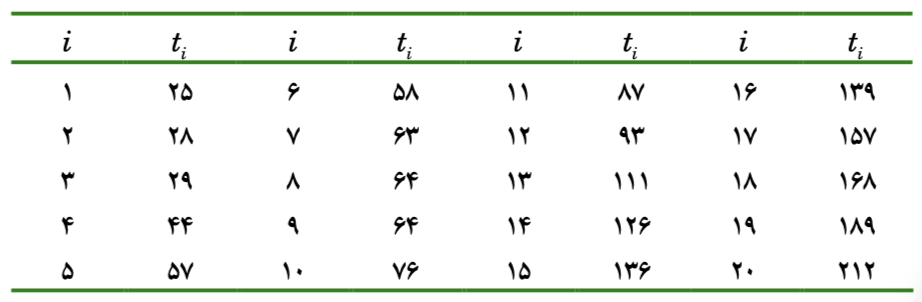

## روش عددی در مثال ۶.۶

اول از همه ما یک سری داده داریم که در جدول زیر مشخص شده است.



```{r}
#| dir: ltr

data <- cbind(c(1:20), c(25,28,29,44,57,58,63,64,64, 76,87,93,111,126,136,139,157,168,189,212))
```

```{r}
#| dir: ltr

y <- data[,2]
y
```

فرمول وایبل نیز به این صورت است:
$$f(t,\lambda, \beta) = \beta\lambda^{\beta}t^{\beta-1}e^{-(\lambda t)^\beta}$$

که log-likelihood آن هم به این شکل می شود

$$l(\lambda , \beta) = \sum_{i=1}^{n} [ln(\beta) + \beta ln(\lambda) + (\beta - 1) ln(t_i) - (\lambda t_i)^\beta]$$

که حالا اگر sum را روی آنها تاثیر بدهیم به این شکل می شود
$$l(\lambda , \beta) =  [nln(\beta) + n\beta ln(\lambda) + (\beta - 1) \sum_{i=1}^{n} ln(t_i) - \sum_{i=1}^{n}(\lambda t_i)^\beta]$$

در کتاب آورده شده است که میتوان مستقیما این فرمول را ماکزیمم کرد یا از مشتق آن به صورت تکرار اعداد را بدست آورد.

ما به صورت مستقیم از تابع likelihood استفاده میکنیم به این شکل که :

- تابعی که میخواهیم آن را ماکزیمم کنیم را در R می نویسیم

- تابع را در دستور optim() قرار می دهیم

تابع بالا در R به صورت زیر قابل تعریف شدن است:

```{r}
#| dir: ltr
f <- function(params, y){
  
  lambda <- params[1]
  beta <- params[2]
  n <- length(y)
  
  n*log(beta) + n*beta*log(lambda) + (beta - 1)*sum(log(y)) - 
    sum((lambda * y)^beta)
  
}
```

بعد از تعریف تابع باید این تابع را به روش های عددی ماکزیمم کنیم:

```{r}
#| warning: false
#| dir: ltr
initialval <- c(1,1)
optim(initialval, f,
      y = y,
      control = list(fnscale = -1),
      method = "BFGS",
      hessian = TRUE)

```

- اول از همه یک نقطه شروع برای پارامتر ها در نظر می گیریم که در initialvalue آنها را قرار می دهیم که برای هر دو پارامتر 1, 1 در نظر گرفته شد

- تابع optim() را فراخوانی می کنیم و اول از همه مقادیر اولیه را در آن قرار می دهیم.

- بعد از آن تابع f که میخواهیم بهینه سازی کنیم را در تابع قرار می دهیم

- بعد از آن داده هایی که از مسئله داشتیم را درون تابع optim() جایگذاری میکنیم

- تابع optim به صورت default تابعی که داریم را مینیمم می کند با دستوری که قرار دادیم ، تابعی که به ما می دهد ماکزیمم هست

- method و hessian هم به روشی که برای بدست آورد جواب نیاز داریم اشاره می کند.
